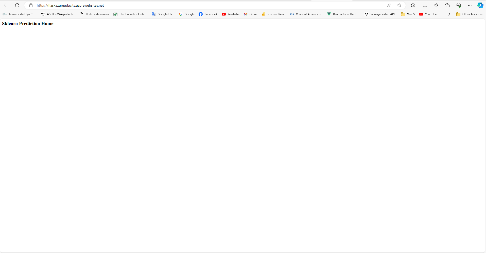

# Overview

This project is a demo of building a CICD with Python Flask App
The technology that is using:

- Terraform: to create all Azure Infrastruture for this project
- Packer: to create VM image for the build agent
- Azure DevOps pipline: to configure CICD and deploy app to the Azure App Service
- Makefile: to automate the CI step
- Python Flask App: with machine learning to make the prediction
- Trello board: To manage the project plan and goals
  
## Project Plan

- [Link to Trello board for the project](https://trello.com/b/INHJj0VK)

- [Link to spreadsheet that includes the original and final project plan](https://docs.google.com/spreadsheets/d/1SgUDdwUD-Np5UactcMUsw3ugj6FKltMeTi2TVjCktIw/edit?usp=sharing)

## Instructions

- Architectural Diagram (Shows how key parts of the system work)>


# How you can run the project?

> To run this project you need the following dependency

- [Install Python 3.8](https://www.python.org/downloads/release/python-380/)
- Install locust: pip3 install locust

> Step to run the app in local

1. Get Flask Starter Code
- [Flask Code](https://github.com/BachBin/flask-azure-udacity.git)


2. Run the command create virtual environment and active that

```bash
python3 -m venv ~/.manhbv-udacity
source ~/.manhbv-udacity/bin/activate
cd flask-azure-udacity
```


3. Run the command to install the dependencies and run the app

```bash
make install
python -m flask run
```

4. Run prediction with local at Azure Cloud Shell

```bash
chmod +x make_prediction.sh
./make_prediction.sh
```

5. Run script to create web app and first deployed to web app

```bash
 ./commands.sh
```

> Step to trigger the CICD pipelines

1. Go to Azure Devops > Create new project

2. Go to Project Settings > Service Connections > New Service Connections

> Screen shoots of the result

- Project running on Azure App Service


- Project cloned into Azure Cloud Shell


- Passing tests that are displayed after running the `make all` command from the `Makefile`


- Output of a test run


- Successful deploy of the project in Azure Pipelines.


- Running Azure App Service from Azure Pipelines automatic deployment


- Successful prediction from deployed flask app in Azure Cloud Shell.


- The application running against a load test with locust.

Load test running:


The output should look similar to this:

```bash
udacity@Azure:~$ ./make_predict_azure_app.sh
Port: 443
{"prediction":[20.35373177134412]}
```

- Output of streamed log files from deployed application


## Enhancements

> Future features to implement on this project:

1. Upgrade to newer python version (example that I did is 3.8)
2. Add configuration key by KeyVault.

## Demo

[Tutorial Video for this Project]()
